# Projektdokumentation - Tidemark

## Inhaltsverzeichnis

1. [Ausgangslage](#1-ausgangslage)
2. [Lösungsidee](#2-lösungsidee)
3. [Vorgehen & Artefakte](#3-vorgehen--artefakte)
    1. [Understand & Define](#31-understand--define)
    2. [Sketch](#32-sketch)
    3. [Decide](#33-decide)
    4. [Prototype](#34-prototype)
    5. [Validate](#35-validate)
4. [Erweiterungen](#4-erweiterungen)
5. [Projektorganisation](#5-projektorganisation)
6. [KI-Deklaration](#6-ki-deklaration)
7. [Anhang](#7-anhang)

---

## 1. Ausgangslage

- **Problem:** Schwimmer, die regelmässig trainieren, haben kaum eine Möglichkeit, ihren Fortschritt direkt mit einem Trainingspartner zu messen und sich gegenseitig zu motivieren. Bestehende Apps wie Strava oder Garmin Connect bieten zwar Tracking-Funktionen, jedoch kein direktes 1-gegen-1-Duell-System. Der soziale Wettkampfgedanke unter Kollegen oder Trainingspartnern wird nicht abgebildet.
- **Ziele:**
  - Eine Web-App entwickeln, die zwei Schwimmer in einem direkten Duell (Battle) gegeneinander antreten lässt
  - Aktivitäten erfassen und in Echtzeit vergleichen
  - Motivation durch Wetten, Achievements und ein monatliches Leaderboard steigern
  - Trainingsabsprachen über einen integrierten Kalender ermöglichen
- **Primäre Zielgruppe:** Hobby- und Vereinsschwimmer, die sich gegenseitig zu regelmässigem Training motivieren wollen, typischerweise im Alter von 16 bis 35 Jahren
- **Weitere Stakeholder:** Schwimmclubs, die die App als internes Motivationstool einsetzen könnten

---

## 2. Lösungsidee

- **Kernfunktionalität:**

  1. **Activity Log — Aktivitäten erfassen und analysieren:** Schwimmer öffnen den Activity Log direkt nach dem Login und erfassen ihre Trainingseinheit mit Distanz (in Metern), Dauer, Schwimmstil (Kraul, Brust, Rücken, Butterfly), Poolgrösse (25m / 50m / 100m) und einer optionalen Notiz. Die App berechnet automatisch Pace (min/100m), Geschwindigkeit (km/h) und Kalorienverbrauch. Alle Aktivitäten werden chronologisch aufgelistet; Gesamtstatistiken (Gesamtdistanz, Gesamtdauer, Durchschnittspace) erscheinen oben in der Übersicht.

  2. **Battle — 1-gegen-1-Duell mit animiertem Balken:** Der Nutzer wählt auf der Battle-Seite einen registrierten Gegner aus, legt eine Zieldistanz (in Metern) und eine optionale Wette fest und erstellt damit ein Battle. Beide Spieler loggen ihre Schwimmaktivitäten, die ab dem Erstellungsdatum des Battles gewertet werden. Ein animierter Wellenbalken verschiebt sich relativ zur Zieldistanz und zeigt jederzeit den aktuellen Vorsprung oder Rückstand an. Wer zuerst einen Vorsprung in Höhe der Zieldistanz herausschwimmt, gewinnt das Battle und erhält ein "You Win!"-Banner.

  3. **Kalender — Trainingsplanung und Einladungen:** Der Kalender stellt alle erfassten Schwimmaktivitäten in einer Monatsübersicht dar; Tage mit Aktivitäten sind markiert und zeigen Anzahl Einheiten sowie Gesamtdistanz an. Per Klick auf einen Tag öffnet sich ein Modal, über das ein anderer registrierter Schwimmer zu einem gemeinsamen Training eingeladen werden kann (Datum, Uhrzeit, Ort, optionale Nachricht). Einladungen werden In-App zugestellt und erscheinen nach Annahme im Kalender und auf der Battle-Seite unter "Upcoming Swims Together".

  4. **Achievements — Freischaltbare Abzeichen:** Das Achievement-System umfasst 12 freischaltbare Abzeichen für Meilensteine wie Distanzrekorde, Trainingsserien, Schwimmstil-Vielfalt und Battle-Teilnahme. Freigeschaltete Badges erscheinen farbig mit Freischaltdatum, gesperrte sind ausgegraut mit Fortschrittsbalken. Das höchste Achievement eines Nutzers wird beim Gegner in der Battle-Auswahl angezeigt und unterstreicht so den Wettkampfcharakter bereits bei der Gegnerauswahl.

  5. **Leaderboard — Monatliche Rangliste:** Auf der Battle-Seite erscheint ganz oben eine Top-5-Rangliste der aktivsten Schwimmer des laufenden Kalendermonats nach geschwommener Gesamtdistanz. Ränge 1 bis 3 sind gold, silber und bronze hervorgehoben. Das spezielle "Sardine"-Achievement für fünf aufeinanderfolgende Niederlagen sorgt für humorvolle Selbstironie und motiviert auch weniger aktive Nutzer zur Battle-Teilnahme.

  6. **Profil — Statistiken, Analyse und Einstellungen:** Die Profilseite zeigt neben Benutzerdaten und Profilbild ein interaktives Liniendiagramm der geschwommenen Distanz über die letzten 7 Tage, 30 Tage oder 3 Monate. Eine Wochenanalyse-Tabelle fasst Distanz, Sessions, Pace und Kalorienverbrauch der letzten 8 Wochen zusammen; persönliche Rekorde (längste Session, schnellste Pace, längste Streak) werden separat ausgewiesen. Dark-Mode-Toggle und eingehende Trainingseinladungen sind ebenfalls hier zugänglich.

  **Übersicht:**
  - **Activity Log:** Schwimmaktivitäten erfassen mit Distanz, Dauer, Schwimmstil, Poolgrösse, Notizen sowie automatisch berechneter Pace und Kalorienverbrauch
  - **Battle:** Zwei Nutzer treten gegeneinander an; wer zuerst eine definierte Vorsprungs-Distanz erreicht, gewinnt. Ein animierter Balken zeigt den aktuellen Stand visuell
  - **Kalender:** Aktivitäten werden im Kalender dargestellt; Nutzer können andere Schwimmer zu gemeinsamen Trainings einladen
  - **Achievements:** Freischaltbare Abzeichen motivieren zu regelmässigem Training und sportlichen Leistungen
  - **Leaderboard:** Monatliche Top-Rangliste aller Nutzer nach geschwommener Distanz
  - **Profil:** Profilbild, Statistiken, Analyse-Diagramme und Dark-Mode-Einstellung

**Gesamtworkflow**

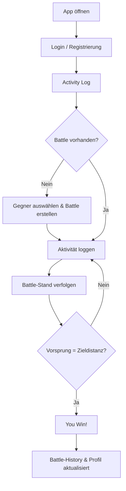

**Auth- & Battle-Workflow**

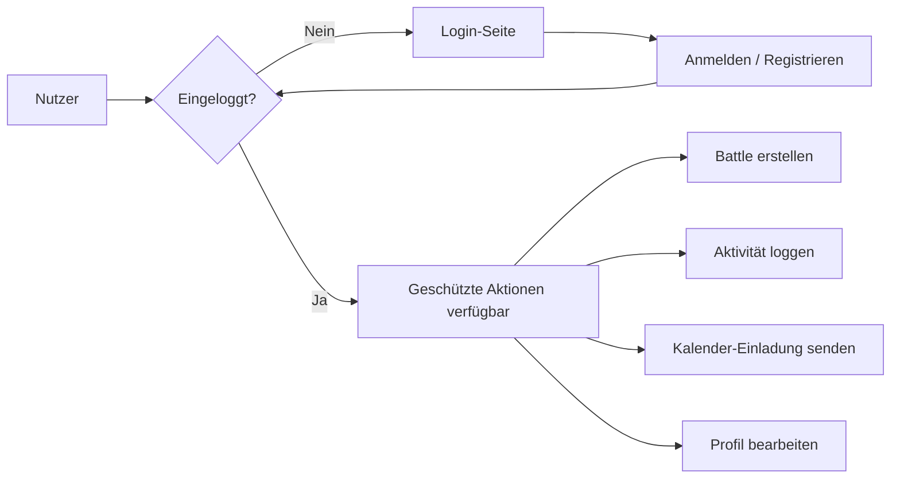

- **Annahmen:**
  - Nutzer sind bereit, ihre Aktivitäten manuell einzugeben (kein GPS-Tracking nötig)
  - Das 1-gegen-1-Konzept ist motivierender als reine Selbstverfolgung
  - Eine Web-App ist für den Einstieg ausreichend; eine native App wäre eine spätere Erweiterung

- **Abgrenzung:**
  - Kein GPS-Tracking
  - Keine Gruppen-Battles (nur 1v1)
  - Kein E-Mail-Versand für Benachrichtigungen (nur In-App)
  - Keine Integration mit Wearables oder externen Sportgeräten

---

## 3. Vorgehen & Artefakte

### 3.1 Understand & Define

- **Zielgruppenverständnis:**

  Zur Problemraumanalyse wurde der persönliche Kontext als Vereinsschwimmer genutzt. Das Kernanliegen ist der fehlende direkte Wettbewerb in bestehenden Tracking-Apps. Eine informelle Befragung im Freundeskreis und Schwimmclub bestätigte das Interesse an einem Battle-Konzept.

  **Proto-Persona: Der Vereinsschwimmer**
  - Name: Luca, 22 Jahre, Student
  - Trainiert 3 bis 4 Mal pro Woche im Hallenbad
  - Nutzt keine Tracking-App
  - Möchte mit seinem Trainingspartner wetteifern und Wetten abschliessen
  - Ist tech-affin und nutzt sein Smartphone täglich

- **Wesentliche Erkenntnisse:**
  - Bestehende Apps (Strava, Garmin) haben kein direktes 1v1-Duell-System für Schwimmen
  - Die Motivation durch Wetten und sichtbaren Rückstand/Vorsprung ist ein starker Antrieb
  - Einfache, intuitive Eingabe ist wichtiger als ein grosser Funktionsumfang
  - Der Battle-Balken muss sofort verständlich sein ohne Erklärung

---

### 3.2 Sketch

- **Variantenüberblick:**

  Im Rahmen der Crazy-8s-Methode wurden 8 verschiedene Varianten für den zentralen Battle-Screen skizziert. Die Varianten unterschieden sich hauptsächlich in der Darstellung des Vergleichs (Balken, Tabelle, Kreisdiagramm, Duell-Ansicht mit zwei Profilen).

- **Skizzen:**
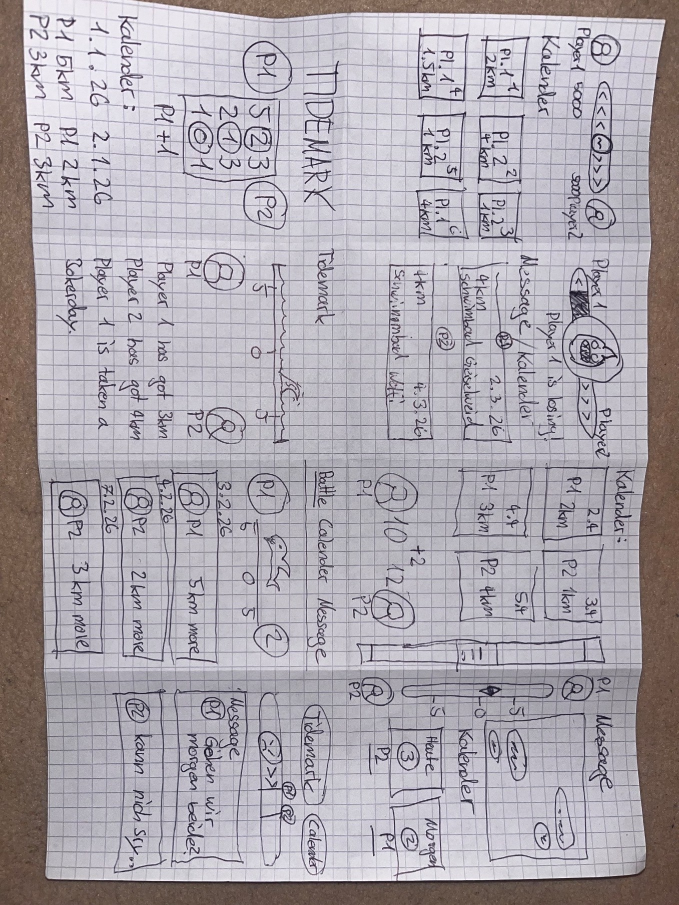
  | Variante | Beschreibung |
  |---|---|
  | Skizze 1 | Einfache Tabelle mit kalender |
  | Skizze 2 | Duell-Ansicht mit zwei Spielerprofilen und Vergleichsbalken oben |
  | Skizze 3 | Fokus auf Kalender keine Battle-Bar sondern mit Zahlen gelöst|
  | Skizze 4 | Chat-ähnliche Ansicht mit Messagebox für Wette |
  | Skizze 5 | Technische Visualisierung mit Graphen (als unübersichtlich bewertet) |
  | Skizze 6 | Schriftliche Lösung der Activity Logs. Fokus auf graphische Darstellung |
  | Skizze 7 | Dashboard-Ansicht mit mehreren Widgets |
  | Skizze 8 | Message-Funktion im Vordergrund mit Battle als Nebenelement |

- **Peer-Feedback (von Sanel Alija):**
  - Positiv: Skizze 2 wegen übersichtlichem Duell-Vergleich; Skizze 4 wegen gut platzierter Messagebox für die Wette
  - Negativ: Skizze 5 zu technisch und unübersichtlich; Skizze 8 zeigt Kalender zu prominent statt Battle

- **Entscheid:** Skizze 2 angepasst (direkter Spielervergleich mit Balken und Wette)

---

### 3.3 Decide

- **Gewählte Variante & Begründung:**

  Der direkte 1-gegen-1-Vergleich mittels eines animierten Distanzbalkens wurde gewählt. Der Wettkampfgedanke ist die Kernidee des Projekts, und diese Variante setzt ihn am direktesten um. Der Mix aus klassischer Datendarstellung (Distanz, Statistiken) und modernem Wettkampfdesign (animierter Balken, Wette, Achievements) spricht die Zielgruppe optimal an.

  Auswahlkriterien:
  - Übersichtlichkeit: auf einen Blick erkennbar, wer führt
  - Intuitivität: keine Erklärung nötig
  - Wettkampfcharakter: visuell ansprechend und motivierend
  - Erweiterbarkeit: Achievements, Leaderboard und Kalender lassen sich ergänzen
**End-to-End-Ablauf (User Journey):**

  1. Nutzer öffnet die App und landet auf der Login/Register-Seite
  2. Nach der Registrierung und der Anmeldung kommt er direkt zum Activity Log
  3. Er wählt einen Gegner aus der Nutzerliste und erstellt ein Battle mit Distanzziel und optionaler Wette
  4. Beide Nutzer loggen ihre Schwimmaktivitäten
  5. Der animierte Battle-Balken zeigt den aktuellen Stand in Echtzeit
  6. Wer zuerst die Zieldistanz als Vorsprung erreicht, gewinnt das Battle
  7. Das Ergebnis wird in der Battle-History gespeichert und im Profil angezeigt

**User Journey Map**

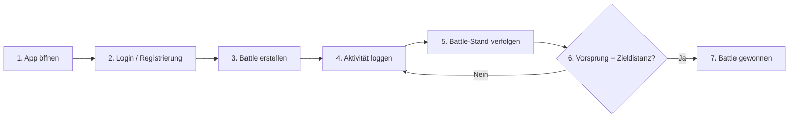

- **Mockup:**

  Tool: Figma (kostenlos, browserbasiert, interaktive Klick-Verbindungen)

  Link: [Tidemark Figma Prototyp](https://www.figma.com/proto/l832VC7lrJmZrYmjXIbj88/Tidemark?node-id=0-1&t=WHQFVi8mltOCs599-1)

  Erstellte Screens:

  | Welcome Screen | Login Screen | Register Screen |
  |---|---|---|
  | 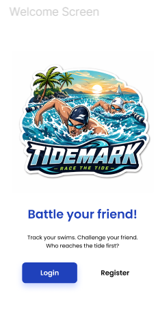 | 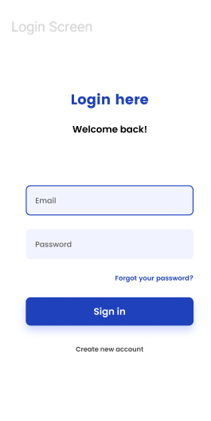 | 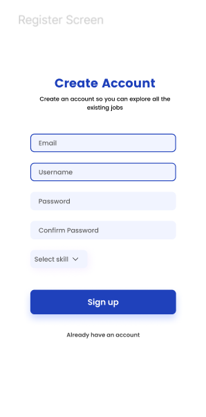 |

  | Battle Screen | Calendar Screen |
  |---|---|
  | 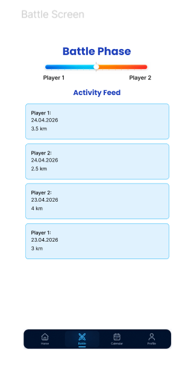 | 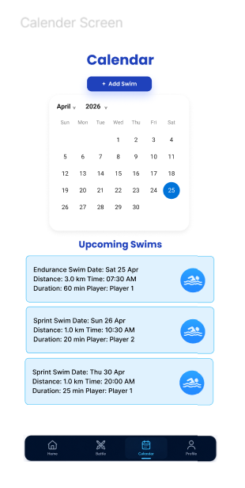 |

  *Mobile-First Design mit Bottom Navigation. Der Battle-Screen zeigt den zentralen Vergleichsbalken zwischen zwei Spielern. Der Calendar-Screen ermöglicht die Planung und Einsicht vergangener Schwimmeinheiten.*
---

### 3.4 Prototype

#### 3.4.1 Entwurf (Design)

- **Informationsarchitektur:**

  Die App ist in 5 Hauptbereiche gegliedert, erreichbar über eine Sidebar (Desktop)
  und eine Bottom Navigation (Mobile):

  | Seite | Funktion |
  |---|---|
  | Activity Log | Schwimmaktivitäten erfassen und einsehen |
  | Battle | Gegner auswählen, Battle erstellen, Stand verfolgen |
  | Calendar | Aktivitäten im Kalender, Trainingseinladungen |
  | Achievements | Freigeschaltete Abzeichen und Fortschritt |
  | Profil | Benutzerdaten, Statistiken, Diagramme, Einstellungen |

- **User Interface Design:**

  **Login & Registrierung**

  | Login (Web) | Dark Mode |
  |---|---|
  | 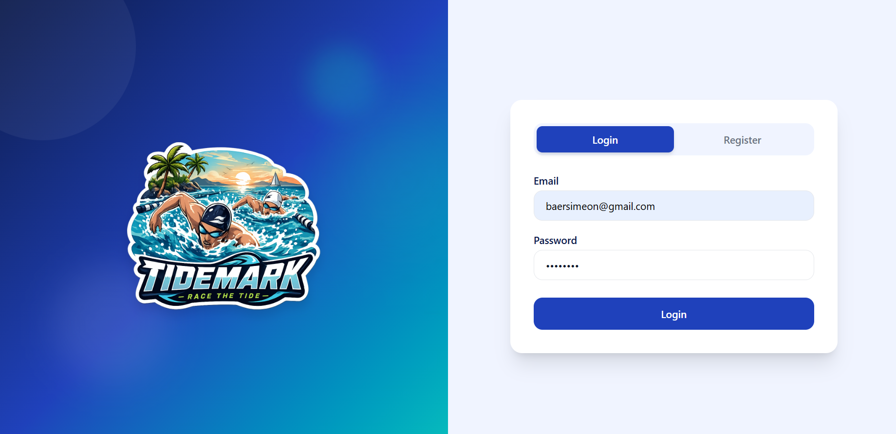 | 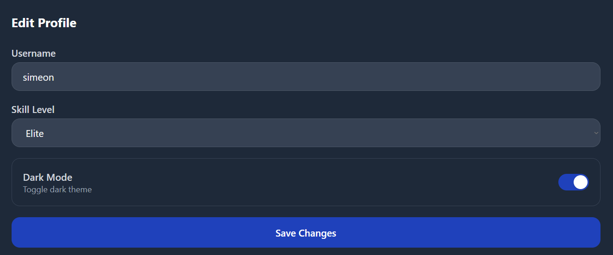 |

  *Split-Layout mit Logo links und Formular rechts. Dark Mode Toggle im Profil
  unter Edit Profile.*

  ---

  **Activity Log**

  | Activity Log (Light) | Activity Log (Dark) | Activity Log (Mobile) |
  |---|---|---|
  | 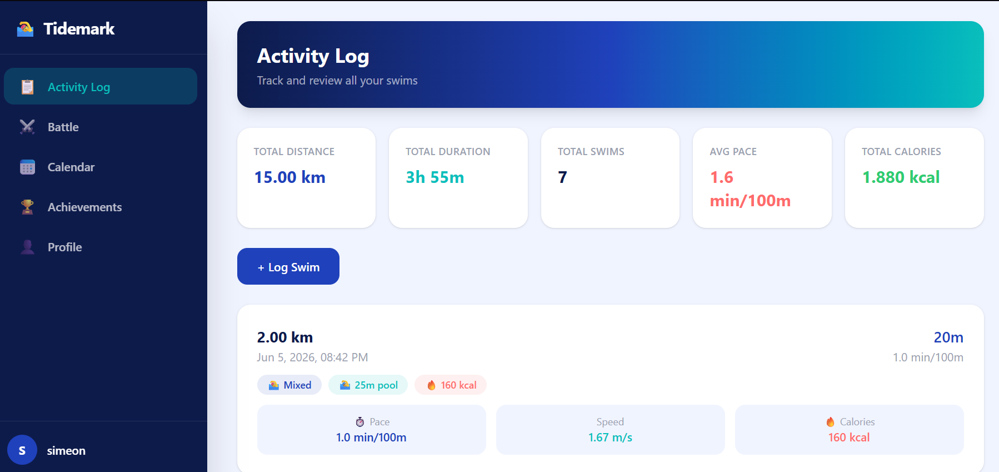 | 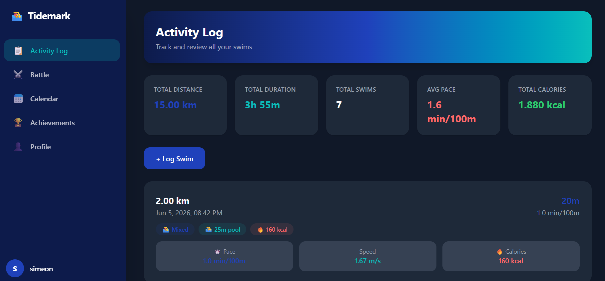 | 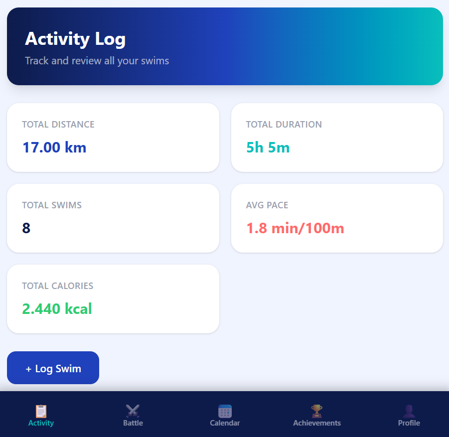 |

  *Übersicht aller Schwimmaktivitäten mit Gesamtstatistiken (Distanz, Dauer, Pace,
  Kalorien). Jede Aktivität zeigt Schwimmstil, Poolgrösse und berechnete Kennzahlen.
  Auf Mobile wird eine Bottom Navigation angezeigt damit der Nutzer nach dem Schwimmen
  schnell seine Daten erfassen kann.*

  ---

  **Battle**

  | Battle Leaderboard | Battle Bar |
  |---|---|
  | 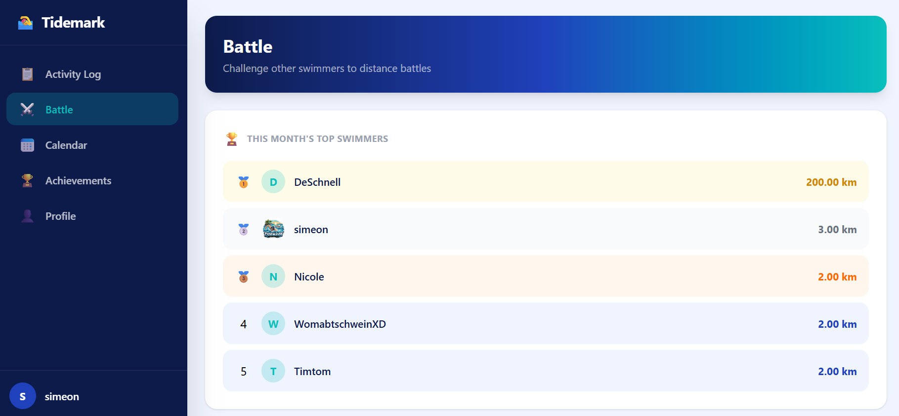 | 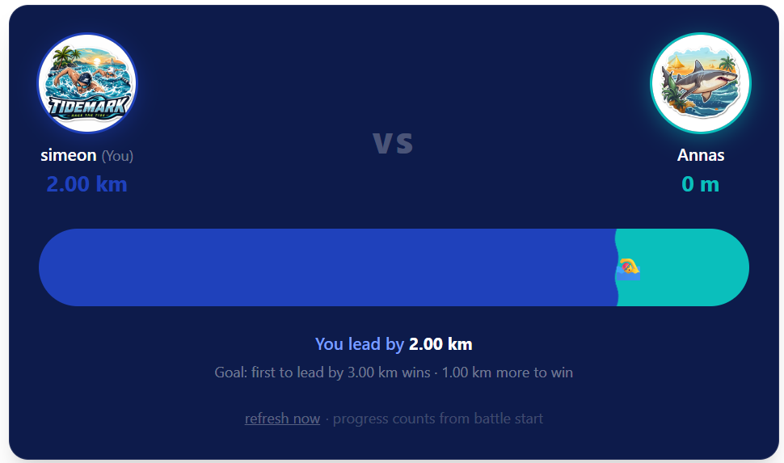 |

  *Die Battle-Seite zeigt oben das monatliche Top-5-Leaderboard. Der animierte
  Wellenbalken verschiebt sich relativ zur Zieldistanz.*

  **Battle gewonnen**

  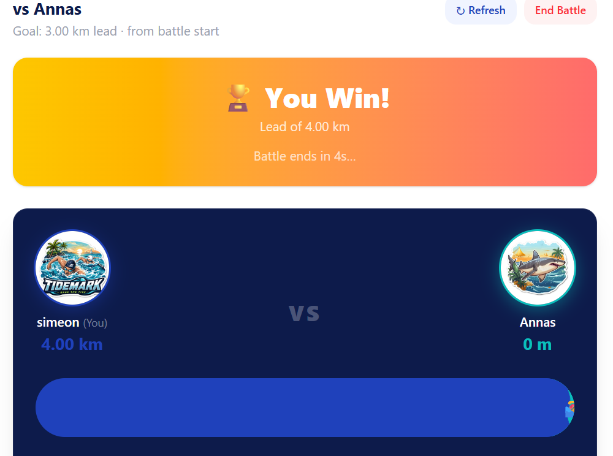

  *Bei Erreichen der Zieldistanz erscheint ein "You Win!" Banner mit
  goldenem Hintergrund.*

  ---

  **Calendar**

  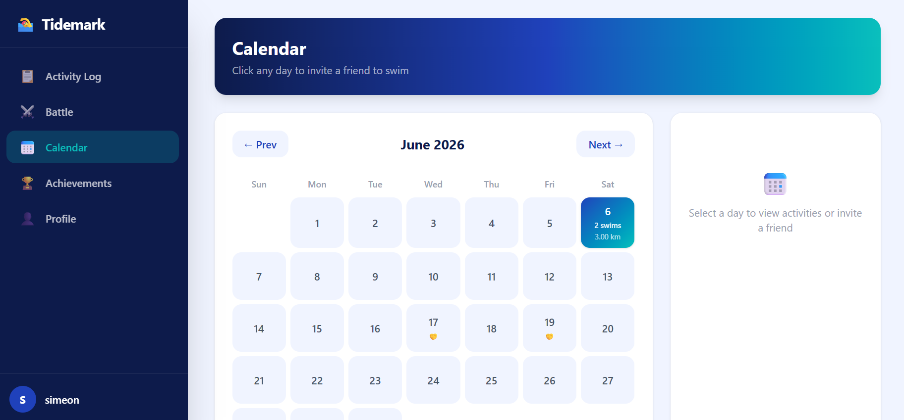

  *Kalenderansicht mit markierten Schwimmtagen. Tage mit Aktivitäten zeigen
  Anzahl Swims und Gesamtdistanz. Klick auf einen Tag ermöglicht das Einladen
  eines Trainingspartners.*

  ---

  **Achievements**

  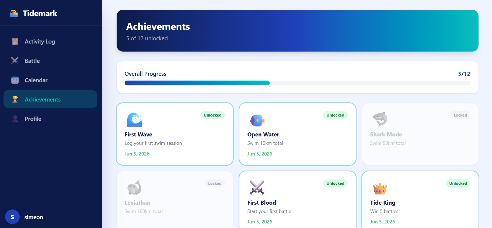

  *12 freischaltbare Abzeichen mit Fortschrittsbalken. Freigeschaltete Badges
  sind farbig mit Datum, gesperrte ausgegraut.*

  ---

  **Profil**

  | Profil Übersicht | Swim Distanz Diagramm |
  |---|---|
  | 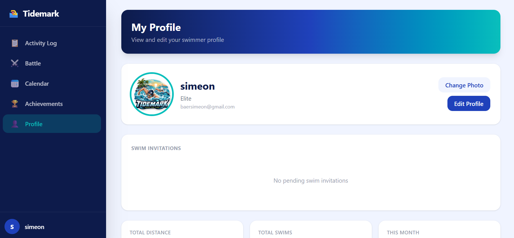 | 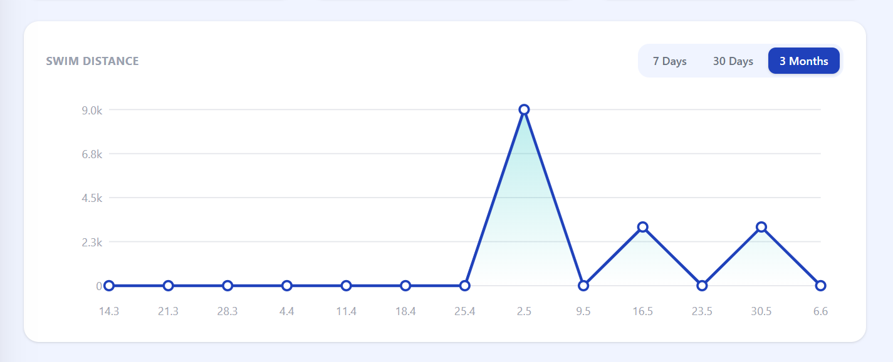 |

  *Profilseite mit Benutzerdaten, Swim Invitations und Statistik-Cards.
  Das Liniendiagramm zeigt die Schwimmdistanz der letzten 7 Tage, 30 Tage
  oder 3 Monate.*

  ---

  **Figma Mockup (Ursprüngliches Design)**

  | Welcome Screen | Login Screen | Register Screen |
  |---|---|---|
  |  |  |  |

  | Battle Screen (Mockup) | Calendar Screen (Mockup) |
  |---|---|
  |  |  |

  *Ursprüngliches Figma Mockup als Mobile-App konzipiert. Die finale Umsetzung
  erfolgte als responsive Web-App mit Desktop-Sidebar.*

  Link zum interaktiven Prototyp: [Tidemark Figma](https://www.figma.com/proto/l832VC7lrJmZrYmjXIbj88/Tidemark?node-id=0-1&t=WHQFVi8mltOCs599-1)

- **Designentscheidungen:**

  | Entscheidung | Begründung |
  |---|---|
  | Desktop Web-App mit Mobile Bottom Navigation | Der Fokus liegt auf der Desktop-Ansicht für eine übersichtliche Nutzung aller Funktionen. Die Mobile Bottom Navigation ermöglicht es Schwimmern, direkt nach dem Training schnell Daten zu erfassen. |
  | Dark Navy (#0D1B4B) als Sidebar-Hintergrund | Maritime Farbwelt die zum Thema Schwimmen, Meer und Wasser passt und die App von generischen Fitness-Apps abhebt. |
  | Animierter Wellenbalken im Battle | Der Balken soll spielerisch und dynamisch wirken. Durch die kontinuierliche Bewegung sieht der Nutzer jederzeit dass sich der Stand verschieben kann. So ist es Realitätsnäher als ein statischer Balken. |
  | Blau (#1F41BB) vs Teal (#0ABFBC) statt Blau vs Rot | Bewusste Abkehr vom Standard-Wettkampfschema. Die Farbkombination repräsentiert das Korallenriff und das Meer und gibt der App einen eigenen Charakter. |
  | Achievements als ausgegraut/farbig | Orientiert an bekannten Gaming-Apps. Die ausgegrauten Badges zeigen dem Nutzer was er noch erreichen kann. Wer alle freischaltet wird mit einer vollständig farbigen Übersicht belohnt. |
  | Monatliches Leaderboard auf der Battle-Seite | Das Leaderboard soll Nutzer direkt beim Aufruf der Battle-Seite motivieren selbst zu schwimmen und ein Battle zu starten um im Ranking zu erscheinen. |

#### 3.4.2 Umsetzung (Technik)

- **Technologie-Stack:**
  - **Frontend:** SvelteKit 5 mit TypeScript
  - **Styling:** Tailwind CSS
  - **Datenbank:** MongoDB Atlas
  - **Authentifizierung:** Eigene Session-basierte Lösung mit JWT
  - **Bildupload:** Base64-Encoding in MongoDB

- **Tooling:**
  - IDE: Visual Studio Code
  - Versionskontrolle: Git & GitHub
  - Deployment: Netlify (automatisches Deploy bei Push auf main)
  - KI-Tools: Siehe Kapitel 6

- **Struktur & Komponenten:**

  ```
  src/
  ├── routes/
  │   ├── auth/           # Login & Register
  │   ├── activity-log/   # Aktivitäten erfassen
  │   ├── battle/         # Battle erstellen & verfolgen
  │   ├── calendar/       # Kalender & Einladungen
  │   ├── achievements/   # Achievement-Übersicht
  │   ├── profile/        # Profil & Einstellungen
  │   └── api/            # Server-seitige API-Routen
  │       ├── users/
  │       ├── activities/
  │       ├── battles/
  │       ├── invites/
  │       ├── achievements/
  │       └── leaderboard/
  ├── lib/
  │   ├── components/     # Sidebar, Navigation, Battle-Bar
  │   ├── stores/         # Theme Store (Dark Mode)
  │   └── db.ts           # MongoDB-Verbindung
  ```

- **Daten & Schnittstellen:**

  MongoDB-Collections:

  | Collection | Felder |
  |---|---|
  | users | username, email, password, skillLevel, profileImage, achievements[] |
  | activities | userId, distance, duration, swimStyle, poolSize, calories, pace, date, notes |
  | battles | challengerId, opponentId, goalDistance, bet, status, createdAt |
  | swim_invites | fromUserId, toUserId, date, time, location, message, status |

  Alle Datenbankzugriffe erfolgen ausschliesslich über SvelteKit API-Routen (+server.ts), nie direkt vom Client.

- **Deployment:**
  - Produktions-URL: [https://tidemark-zhaw.netlify.app](https://tidemark-zhaw.netlify.app)
  - Automatisches Deployment via Netlify bei jedem Push auf den main-Branch
  - Umgebungsvariablen (MongoDB URI, JWT Secret) sind in Netlify konfiguriert

- **Besondere Entscheidungen:**

  | Entscheidung | Begründung |
  |---|---|
  | Battle-Balken-Formel: (myDist - oppDist + goal) / (2 * goal) | Erster Ansatz war ein einfacher Links-rechts-Balken, der aber nicht prozentual zur Zieldistanz funktionierte und damit nicht aussagekräftig war. Die Formel zeigt den relativen Vorsprung zum Ziel und macht den Stand sofort verständlich. |
  | Aktivitäten nur ab Battle-Startdatum zählen | Zwei Probleme wurden identifiziert: Nutzer konnten Aktivitäten in der Zukunft erfassen die direkt mitgezählt wurden, und bestehende Aktivitäten vor dem Battle-Start gaben erfahrenen Nutzern einen unfairen Vorteil gegenüber Neulingen. Beides wurde behoben: Aktivitäten können nur noch am gleichen Tag oder in der Vergangenheit erfasst werden, und nur Aktivitäten nach Battle-Erstellung zählen. Zusätzlich wurde ein manueller Refresh eingebaut da der Stand sich nicht automatisch aktualisierte. |
  | Base64 für Profilbilder | Bewusste Entscheidung für die einfachste Lösung ohne separaten File-Server. Der Trade-off ist dass MongoDB-Dokumente grösser werden da das Bild direkt im User-Dokument gespeichert ist. Für einen Produktivsystem würde man AWS S3 oder ähnlichen Cloud-Speicher nutzen. Für einen Prototyp war es die pragmatische Wahl da keine zusätzliche Infrastruktur nötig war. |
  | Dark Mode via CSS class auf html-Element | Tailwind CSS bietet eine eingebaute dark:-Variante die aktiviert wird sobald die Klasse dark auf dem html-Element gesetzt wird. Da das Projekt bereits Tailwind nutzt war das die naheliegendste Lösung ohne zusätzliche Bibliothek. Die Einstellung wird in localStorage gespeichert damit der Nutzer beim nächsten Besuch nicht erneut umschalten muss. |
---

### 3.5 Validate

- **URL der getesteten Version:** [https://tidemark-zhaw.netlify.app](https://tidemark-zhaw.netlify.app)

- **Ziele der Prüfung:**
  - Ist die Navigation zwischen den Seiten intuitiv?
  - Kann ein neuer Nutzer sich selbstständig registrieren und ein Battle starten?
  - Ist die Darstellung des Battle-Balkens verständlich?
  - Funktioniert der Activity Log fehlerfrei?
  - Funktioniert das Battle-Konzept im realen Nutzungskontext?

- **Vorgehen:** Die Evaluation erfolgte in drei aufeinanderfolgenden Phasen: 
  informelles Testen, ein Feldtest im realen Nutzungskontext und ein moderierter 
  Usability-Test mit Studierenden.


#### Phase 1 — Informeller Test (Familie & Schwimmclub)

- **Stichprobe:** Mehrere Personen aus dem Familienumfeld und dem Schwimmclub, 
  ohne technische Vorgaben oder Aufgaben.
- **Vorgehen:** Unmoderiert, Die Testpersonen nutzten die App frei 
  ohne Anleitung.
- **Beobachtungen:**
  - Die App wirkt intuitiv und ansprechend
  - Die Anmeldung funktionierte problemlos
  - Der Battle-Balken war verständlich
  - Vergangene Aktivitäten wurden fälschlicherweise in neue Battles 
    eingerechnet. Wer länger auf der App war hatte einen unfairen Vorteil
  - Die Pace-Darstellung entsprach nicht dem Standard von Garmin 
  - Der Kalorienverbrauch wurde als ungenau wahrgenommen
  - Der Wunsch nach mehr Datenvisualisierung wurde geäussert

- **Abgeleitete Verbesserungen:**

  | Priorität | Verbesserung | Umgesetzt |
  |---|---|---|
  | Hoch | Aktivitäten nur ab Battle-Startdatum zählen | Ja |
  | Mittel | Pace auf min/100m anpassen (Garmin-Standard) | Ja |
  | Mittel | Datenvisualisierung als Liniendiagramm im Profil | Ja |
  | Tief | Kalorienberechnung verbessern | Ja |

#### Phase 2 — Feldtest (Simeon Bär & Yanis Welwolo)

- **Stichprobe:** Zwei aktive Schwimmer aus dem Schwimmclub, die die App 
  über eine Woche im echten Trainingsalltag nutzten.
- **Vorgehen:** Unmoderiert, über eine Woche. Beide Nutzer schwammen 
  gegeneinander und nutzten alle Funktionen der App im realen Kontext.
- **Beobachtungen:**
  - Das Battle-Konzept funktioniert motivierend im realen Nutzungskontext
  - Ein Battle über eine Woche war problemlos durchführbar
  - Die Kalender-Einladungsfunktion funktionierte nicht zuverlässig
  - Der Battle-Stand aktualisierte sich nicht automatisch und musste 
    manuell refreshed werden

- **Abgeleitete Verbesserungen:**

  | Priorität | Verbesserung | Umgesetzt |
  |---|---|---|
  | Hoch | Manueller Refresh-Button für Battle-Stand | Ja |
  | Mittel | Kalender-Einladungen stabilisieren | Ja |


#### Phase 3 — Moderierter Usability-Test (Obligatorisch)

- **Stichprobe:** 3 Studierende aus dem gleichen Studiengang:
  Issa Fawaz, Daniel Kern, Sanel Alija
- **Vorgehen:** Moderiert, on-site. Die Testpersonen erhielten konkrete 
  Aufgaben und wurden dabei beobachtet.

- **Aufgaben/Szenarien:**

  | Nr. | Aufgabe |
  |---|---|
  | 1 | Registriere dich mit deiner E-Mail-Adresse |
  | 2 | Erstelle ein Battle gegen den Testnutzer mit einem Ziel von 5 km |
  | 3 | Logge eine Schwimmaktivität von 1500 m, 30 Minuten, Kraul |
  | 4 | Schau dir den aktuellen Battle-Stand an |
  | 5 | Passe dein Profilbild an |

- **Kennzahlen & Beobachtungen:**

  | Aufgabe | Erfolgsquote | Beobachtung |
  |---|---|---|
  | Registrierung | 100% | Problemlos, Formular klar verständlich |
  | Battle erstellen | 100% | Intuitiv, Zielfeld war sofort verständlich |
  | Activity Log | 100% | Eingabe verlief reibungslos |
  | Battle-Stand | 80% | Verwirrung weil Battle-Seite anfangs die erste Seite war |
  | Profilbild | 100% | Upload und Anzeige funktionierten einwandfrei |

  Qualitative Findings:
  - Das Farbschema wurde durchgehend positiv bewertet
  - Die Battle-Seite als Startseite war für neue Nutzer ohne bestehendes 
    Battle überfordernd


- **Abgeleitete Verbesserungen:**

  | Priorität | Verbesserung | Umgesetzt |
  |---|---|---|
  | Hoch | Activity Log als Startseite nach Login | Ja |
  | Hoch | Battle-Balken relativ zur Zieldistanz verschieben | Ja |
  | Mittel | Dark Mode Toggle im Profil | Ja |
  | Mittel | Achievements und monatliches Leaderboard | Ja |
  | Mittel | Kalender-Einladungen für gemeinsames Training | Ja |

- **Zusammenfassung der Resultate:**

  Die drei Testphasen zeigten ein konsistentes Bild: Die Kernfunktionen 
  Registration, Battle-Erstellung und Activity-Logging funktionieren 
  zuverlässig und wurden intuitiv bedient. Der Feldtest bewies dass das 
  Battle-Konzept auch im realen Nutzungskontext über eine Woche 
  funktioniert und motivierend wirkt. Die wichtigsten Verbesserungen 
  betrafen die Battle-Logik (Startdatum, Balken-Formel), die Navigation 
  und die Datenvisualisierung.

## 4. Erweiterungen

### 4.1 Erweiterter Activity Log

- **Beschreibung & Nutzen:** Der Activity Log wurde um Schwimmstil (Kraul, Brust, Rücken, Butterfly), Poolgrösse (25m/50m/100m), automatische Berechnung von Pace (min/100m), Geschwindigkeit (km/h) und Kalorienverbrauch erweitert. Dies gibt Schwimmern deutlich mehr Kontext zu ihren Trainings.
- **Wo umgesetzt:**
  - **Frontend:** Zusatzfelder im Activity-Log-Formular
  - **Backend:** Berechnungslogik in der API-Route `/api/activities`
  - **Datenbank:** Erweiterte Activities-Collection in MongoDB
- **Referenz:** Kapitel 3.4.2 (Daten & Schnittstellen)
- **Aus Evaluation abgeleitet?:** Teilweise (Kalorienberechnung als Finding identifiziert)

---

### 4.2 Profilseite mit Strava-Style Analyse

- **Beschreibung & Nutzen:** Das Profil zeigt neben Basisdaten ein interaktives Liniendiagramm der letzten 7/30/90 Tage, eine Wochenanalyse-Tabelle (Distanz, Sessions, Pace, Kalorien der letzten 8 Wochen), monatliche Vergleiche mit Vormonat sowie persönliche Rekorde (längste Session, schnellste Pace, längste Streak). Dies gibt Schwimmern einen umfassenden Überblick über ihre Entwicklung.
- **Wo umgesetzt:**
  - **Frontend:** Neue Sektionen in `src/routes/profile/+page.svelte` mit SVG-basiertem Diagramm
  - **Backend:** Aggregations-Queries in MongoDB für Wochen- und Monatsauswertungen
- **Referenz:** Kapitel 3.5 (abgeleitete Verbesserungen)
- **Aus Evaluation abgeleitet?:** Ja, Wunsch nach Datenvisualisierung wurde von mehreren Testpersonen geäussert

---

### 4.3 Achievements-System

- **Beschreibung & Nutzen:** 12 freischaltbare Abzeichen motivieren Nutzer zu regelmässigem Training, Battle-Teilnahme und stilistischer Vielfalt. Gesperrte Achievements sind ausgegraut, freigeschaltete farbig mit Datum. Das höchste Achievement wird beim Gegner in der Battle-Auswahl angezeigt.
- **Wo umgesetzt:**
  - **Frontend:** Neue Seite `/achievements` mit Grid-Ansicht
  - **Backend:** API-Route `/api/achievements` prüft alle Bedingungen gegen MongoDB-Daten
  - **Datenbank:** `achievements[]`-Array im User-Dokument
- **Referenz:** Kapitel 3.5 (abgeleitete Verbesserungen)
- **Aus Evaluation abgeleitet?:** Ja, Wunsch nach Motivatoren wurde explizit geäussert

---

### 4.4 Monatliches Leaderboard

- **Beschreibung & Nutzen:** Eine Top-5-Rangliste auf der Battle-Seite zeigt die aktivsten Schwimmer des laufenden Monats. Rang 1 bis 3 sind gold/silber/bronze hervorgehoben. Der Leaderboard-Eintrag "Sardine" (5 Niederlagen in Folge) sorgt für humorvolle Selbstironie.
- **Wo umgesetzt:**
  - **Frontend:** Leaderboard-Sektion oben auf der Battle-Seite
  - **Backend:** API-Route `/api/leaderboard/monthly` mit MongoDB-Aggregation nach Monat
- **Referenz:** Battle-Seite oben
- **Aus Evaluation abgeleitet?:** Ja, Wunsch nach globalem Ranking geäussert

---

### 4.5 Kalender-Einladungen

- **Beschreibung & Nutzen:** Nutzer können direkt aus dem Kalender andere registrierte Schwimmer zu gemeinsamen Trainings einladen (Datum, Uhrzeit, Ort, optionale Nachricht). Einladungen werden In-App zugestellt und können im Profil angenommen oder abgelehnt werden. Akzeptierte Trainings erscheinen im Kalender und auf der Battle-Seite unter "Upcoming Swims Together".
- **Wo umgesetzt:**
  - **Frontend:** Modal in `/calendar`, Benachrichtigungs-Sektion in `/profile`, Badge auf Profil-Icon
  - **Backend:** API-Routen `/api/invites` (GET, POST, PATCH)
  - **Datenbank:** Neue Collection `swim_invites`
- **Referenz:** Kapitel 3.5 (abgeleitete Verbesserungen)
- **Aus Evaluation abgeleitet?:** Ja, Kommunikationsbedarf für Trainingsabsprachen wurde identifiziert

---

### 4.6 Dark Mode

- **Beschreibung & Nutzen:** Ein manueller Toggle im Profil schaltet die App zwischen hellem und dunklem Design. Die Einstellung wird im localStorage gespeichert und bleibt nach Seitenreload erhalten.
- **Wo umgesetzt:**
  - **Frontend:** Theme-Store in `src/lib/stores/theme.ts`, `dark:`-Klassen auf allen Seiten und Komponenten, Toggle in `/profile`
- **Referenz:** Profil-Seite, Einstellungsbereich
- **Aus Evaluation abgeleitet?:** Ja, als Verbesserung nach Evaluation priorisiert

---

### 4.7 Animierter Wellenbalken im Battle

- **Beschreibung & Nutzen:** Der Battle-Balken wurde von einem einfachen statischen Balken zu einem animierten Wellendesign umgestaltet. Die Position berechnet sich relativ zur Zieldistanz `(myDist - oppDist + goal) / (2 * goal)`. Die Wellentrennlinie animiert sich kontinuierlich und vermittelt das aquatische Thema.
- **Wo umgesetzt:**
  - **Frontend:** SVG-Wellenform mit CSS-Animation in der Battle-Komponente, VS-Header mit Profilbildern
- **Referenz:** Kapitel 3.3, Kapitel 3.5
- **Aus Evaluation abgeleitet?:** Ja, der Wunsch nach einem variablen, ansprechenderen Balken wurde direkt geäussert

---

## 5. Projektorganisation

- **Repository & Struktur:** [https://github.com/simeonbaer/tidemark](https://github.com/simeonbaer/tidemark)

  ```
  tidemark/
  ├── src/           # SvelteKit Quellcode
  ├── static/        # Statische Assets (Logo, Favicon)
  ├── doc/           # Projektdokumentation und Artefakte
  ├── README.md      # Diese Dokumentation
  └── .env           # Umgebungsvariablen (nicht im Repo)
  ```

- **Commit-Praxis:** Sprechende Commits mit Präfix-Konvention:
  - `feat:` für neue Features
  - `fix:` für Bugfixes
  - `refactor:` für Umstrukturierungen
  - Beispiele: `feat: achievements system and monthly leaderboard`, `fix: battle bar position calculation relative to goal`

---

## 6. KI-Deklaration

### 6.1 KI-Tools

- **Eingesetzte Tools:**
  - **GitHub Copilot** (Agent Mode in VS Code): Initiales Projekt-Setup und erste Grundstruktur
  - **Claude Code** (Anthropic, Sonnet 4.5): Hauptwerkzeug für Feature-Entwicklung, Bugfixes und Refactoring
  - **Claude** (claude.ai, Sonnet 4.6): Konzeption, Prompt-Planung, Dokumentation, Bildbearbeitung (Logo-Hintergrundentfernung)
  - **ChatGPT** (GPT-4o): Bildbearbeitung für Logo-Optimierung

- **Zweck & Umfang:**
  - **Copilot:** Erstellung der initialen Projektstruktur, MongoDB-Anbindung, Basis-Routing. Der generierte Code enthielt Svelte-4-Syntax-Fehler, die anschliessend mit Claude Code korrigiert wurden.
  - **Claude Code:** Umsetzung aller Features ab Woche 11 (Activity-Log-Erweiterungen, Profilseite, Battle-Bar-Redesign, Achievements, Leaderboard, Kalender-Einladungen, Dark Mode, Diagramme). Alle Prompts wurden bewusst strukturiert und iterativ verfeinert.
  - **Claude (claude.ai):** Architekturentscheidungen besprochen, Prompts für Claude Code ausgearbeitet, README geschrieben, Logo-PNG-Hintergrund entfernt (Python/Pillow).
  - **ChatGPT:** Logo-Hintergrundentfernung als Alternative getestet.

- **Eigene Leistung (Abgrenzung):**
  - Gesamtkonzept, Projektidee und Design-Entscheidungen sind eigenständig erarbeitet
  - Alle Prompts wurden selbst formuliert und iterativ angepasst
  - Generierter Code wurde jeweils auf Korrektheit, Funktionalität und Sicherheit geprüft
  - Evaluation, Auswertung und Verbesserungsableitung erfolgten eigenständig
  - Dokumentation wurde auf Basis eigener Erkenntnisse verfasst (mit KI-Unterstützung bei Struktur und Formulierung)

---

### 6.2 Prompt-Vorgehen

Das grundlegende Vorgehen beim Prompting war iterativ und kontextbasiert. Zu Beginn wurde mit GitHub Copilot ein initiales Setup erstellt, wobei der Prompt die gesamte App-Architektur beschrieb (Technologie-Stack, Seiten, Datenbank-Collections). Da Copilot veraltete Svelte-4-Syntax generierte, wurde auf Claude Code gewechselt.

Bei Claude Code wurden Prompts bewusst strukturiert: Zuerst ein kurzer Kontext ("This is a SvelteKit swim battle app called Tidemark with MongoDB"), dann klar nummerierte Tasks mit konkreten Anforderungen pro Aufgabe. Technische Details wie Dateinamen, Farbcodes und Formeln wurden explizit angegeben um Fehlinterpretationen zu vermeiden. Jeder Prompt endete mit einem Build-Befehl und einem Git-Commit, um Fortschritt zu sichern.

Bei komplexen Features (z.B. Battle-Balken-Formel, Achievement-Bedingungen) wurde die Logik zuerst in Claude (claude.ai) besprochen und erst nach Klärung in einen Claude-Code-Prompt umgewandelt. Dies verhinderte fehlerhafte Implementierungen.

Urheberrechtlich verwendete Assets (Logo) wurden mit KI-Bildtools erstellt und liegen im Eigentum des Projekts. Externe Bibliotheken und Frameworks werden gemäss ihren Open-Source-Lizenzen verwendet.

---

### 6.3 Reflexion

**Nutzen:** KI-Tools haben die Entwicklungsgeschwindigkeit erheblich gesteigert. Features, die manuell mehrere Stunden gedauert hätten (z.B. das Achievements-System mit MongoDB-Integration), konnten in Minuten umgesetzt werden. Die Kombination aus Claude (Planung) und Claude Code (Umsetzung) erwies sich als sehr effektiv.

**Grenzen:** KI-generierter Code muss immer auf Korrektheit geprüft werden. Copilot generierte veraltete Syntax, Claude Code machte gelegentlich Annahmen über Dateinamen oder Strukturen die nicht mit dem Ist-Zustand übereinstimmten. Ohne eigenes Verständnis der Codebasis wären diese Fehler schwer zu erkennen gewesen.

**Risiken & Qualitätssicherung:** Nach jedem KI-generierten Feature wurde `npm run build` ausgeführt um Build-Fehler sofort zu erkennen. Zudem wurden alle Funktionen manuell im Browser getestet. Die Verantwortung für Korrektheit, Sicherheit und Urheberrecht liegt beim Entwickler, nicht beim KI-Tool.

---

## 7. Anhang

- **Figma Mockup:** [https://www.figma.com/proto/l832VC7lrJmZrYmjXIbj88/Tidemark](https://www.figma.com/proto/l832VC7lrJmZrYmjXIbj88/Tidemark?node-id=0-1&t=WHQFVi8mltOCs599-1)
- **Deployed App:** [https://tidemark-zhaw.netlify.app](https://tidemark-zhaw.netlify.app)
- **GitHub Repository:** [https://github.com/simeonbaer/tidemark](https://github.com/simeonbaer/tidemark)
- **Quellen & Assets:**
  - Logo: KI-generiert mit DALL-E (ChatGPT), Eigentumsrecht beim Autor
  - Tailwind CSS: MIT-Lizenz
  - SvelteKit: MIT-Lizenz
  - MongoDB Node.js Driver: Apache-2.0-Lizenz
